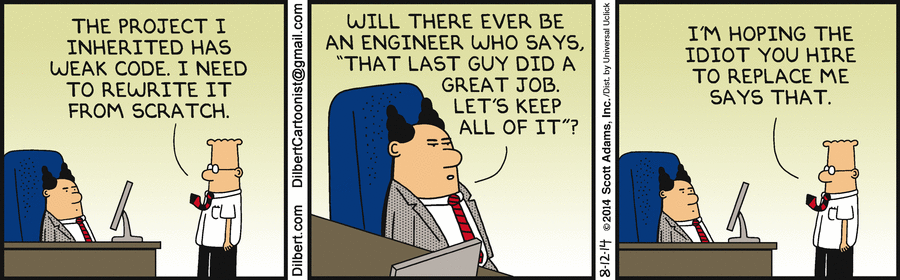

Hey everybody! Trying React & Gatsby through (finally) starting a blog.
How exciting!

It's late and I'm not going to make any promises, but try to keep an eye on it!

Meanwhile, here's a great quote from Joel Spolsky's  
[Things You Should Never Do, Part I](https://www.joelonsoftware.com/2000/04/06/things-you-should-never-do-part-i/).

> The idea that new code is better than old is patently absurd.
> Old code has been used. It has been tested. Lots of bugs have
> been found, and they’ve been fixed. There’s nothing wrong with it.
> It doesn’t acquire bugs just by sitting around on your hard drive.
> Au contraire, baby! Is software supposed to be like an old Dodge
> Dart, that rusts just sitting in the garage? Is software like a
> teddy bear that’s kind of gross if it’s not made out of all new material?

And a Gilbert's cartoon on the same subject.

